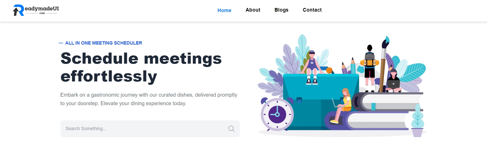

# Blog Project

Welcome to the **Blog Project** repository! This is a single-page blog website built using **React** with **React Router** for seamless navigation and routing between different sections of the application.

**You can view the completed site by going to this link:
https://react-blog-project-2534.netlify.app/**



## Purpose

The Blog Project is designed to provide a clean and engaging user experience for blog readers and creators. It is a modern implementation of a blog site where you can navigate between pages without refreshing the browser, thanks to React's dynamic routing capabilities.

---

## Features

### 1. **Single Page Application (SPA):**

- Fast and responsive navigation.
- No page reloads, thanks to React Router.

### 2. **Dynamic Routing:**

- Easily switch between home, blog posts, and about sections.
- Seamless user experience.

### 3. **Modern UI:**

- Clean, responsive design.
- Mobile-friendly layout.

### 4. **Interactive Components:**

- Dynamic rendering of blog posts.
- Reusable components for scalability.

---

## Usage Guide

### Installation

To use or modify this project, follow these steps:

1. Clone this repository to your local machine:

   ```bash
   git clone https://github.com/ashik-2534/Blog-Project.git
   ```

2. Navigate to the project directory:

   ```bash
   cd blog-project
   ```

3. Install the necessary dependencies:

   ```bash
   npm install
   ```

4. Start the development server:

   ```bash
   npm run dev
   ```

   The project will run at `http://localhost:5173/` by default.

5. To Get the dist folder:

   ```bash
    npm run build
   ```

    The dist folder is the version of your app ready to be deployed to a web server (e.g., Netlify, Vercel, or any hosting service). You typically upload this folder's contents for hosting your website in production.

---

###  Project Structure

```
blog-project/
├── node_modules/            # Installed dependencies
├── public/                  # Static public assets
│   ├── index.html           # Main HTML file
│   └── favicon.ico          # Favicon for the site
├── src/                     # Source code
│   ├── assets/              # Static assets like images
│   │   ├── react.svg
│   │   └── ...
│   ├── Components/          # Reusable UI components
│   │   ├── AboutComponents/
│   │   ├── BlogComponents/
│   │   ├── ContactComponents/
│   │   ├── Footer/
│   │   ├── HomeComponents/
│   │   └── Navbar/
│   ├── Layouts/MainLayouts  # Layout components
│   │   └── MainLayouts.jsx  # Main layout structure
│   ├── Pages/               # Application pages
│   │   ├── About/
│   │   ├── Blogs/
│   │   ├── Contact/
│   │   └── Home/
│   ├── index.css            # Global styles
│   └── main.jsx             # Entry point for React
├── .gitignore               # Git ignore file
├── index.html               # HTML template
├── package.json             # Dependencies and scripts
├── README.md                # Project documentation
├── postcss.config.js        # PostCSS configuration
├── tailwind.config.js       # TailwindCSS configuration
├── vite.config.js           # Vite configuration
```

---

### Example Usage

#### Home Page

The home page displays an overview of the blog. Users can view recent posts or navigate to specific topics.

#### Blog Posts

Each blog post is displayed as a card on the blog page. Users can click on a card to view the full details of the blog post on a dedicated route.

#### About Page

The about page introduces the blog and its purpose. It includes a **Team Section** where users can learn about the people behind the project.

#### Contact Page

The contact page contains a **Contact Form** that allows users to send inquiries or feedback directly through the website.

---

## Code Snippets

### Routing Example

```jsx
import { createRoot } from "react-dom/client";
import "./index.css";
import { BrowserRouter, Route, Routes } from "react-router";
import MainLayouts from "./Layouts/MainLayouts/MainLayouts";
import Home from "./Pages/Home/Home";
import About from "./Pages/About/About";
import Contact from "./Pages/Contact/Contact";
import Blogs from "./Pages/Blogs/Blogs.jsx";

createRoot(document.getElementById("root")).render(
  <BrowserRouter>
    <Routes>
      <Route path="/" element={<MainLayouts />}>
        <Route path="/" element={<Home />} />
        <Route path="/about" element={<About />} />
        <Route path="/blogs" element={<Blogs />} />
        <Route path="/contact" element={<Contact />} />
      </Route>
    </Routes>
  </BrowserRouter>
);
```

---

## Contribution

Contributions are welcome! To contribute:

1. Fork the repository.
2. Create a new branch:

   ```bash
   git checkout -b feature-name
   ```

3. Make your changes and commit them:

   ```bash
   git commit -m "Add feature-name"
   ```

4. Push your changes:

   ```bash
   git push origin feature-name
   ```

5. Open a pull request.

---

## License

This project is licensed under the MIT License. See the [LICENSE](./LICENSE) file for details.

---

## Acknowledgments

- Thanks to the React community for their incredible documentation and support.
- Special thanks to all contributors who helped shape this project.

---

Happy coding! If you have any questions or feedback, feel free to reach out. 🚀
